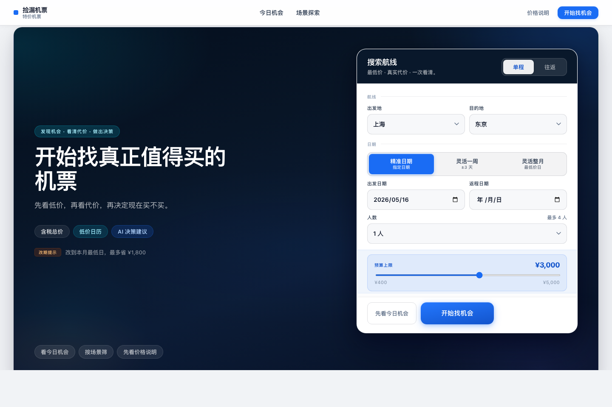
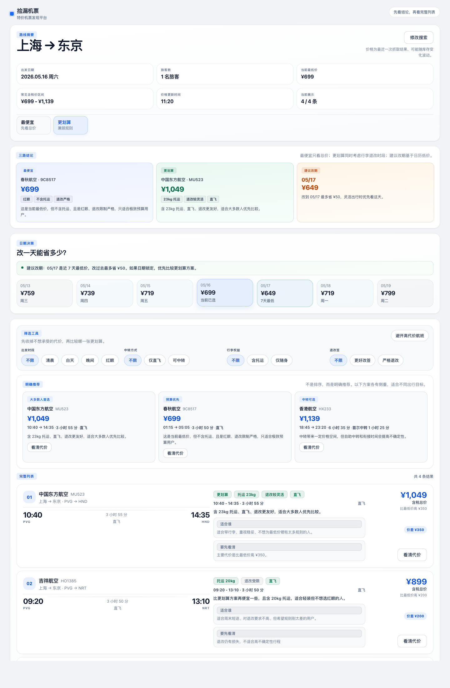
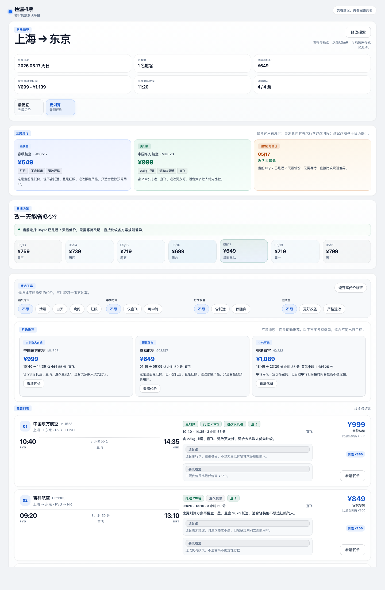
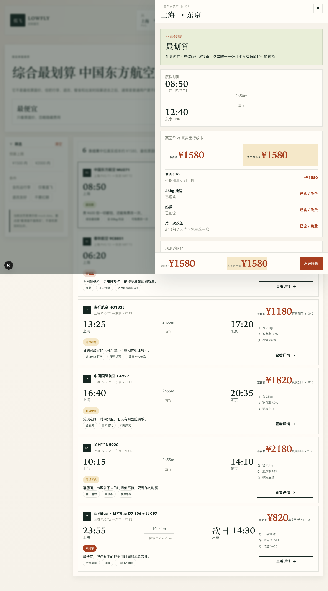

# flight-deal-finder-showcase

AI-coded product prototype for discounted-flight discovery, transparent fare rules, and booking decision support.

> Public showcase only. This repository presents a deterministic product prototype, not a live travel booking service.

Built for hiring review: a frontend-first AI product prototype showing product judgment, interface hierarchy, and transparent decision support under tight prototype scope.



This repository highlights:
- A discovery-first homepage that combines search, curated entry points, and featured fare opportunities
- A results experience that separates "Cheapest" from "Best Value" instead of treating all low fares as equivalent
- A rule-transparency layer that makes baggage, change limits, transfer risk, and total cost visible before a user decides

**Demo:** [Live site](https://meituan-flight-demo.vercel.app) · [Architecture notes](docs/architecture.md) · [Product brief](docs/product-brief.md) · [Demo script](docs/demo-script.md) · [Public release manifest](docs/public-release-manifest.md)

## Overview

`flight-deal-finder-showcase` is a frontend-first product prototype for discounted-flight discovery. The product is designed around a simple but under-served travel decision problem: low fares are easy to advertise, but much harder to interpret. A fare that looks cheap may hide baggage fees, rigid change rules, red-eye timing, or risky transfer conditions that make it a poor decision in practice.

This repository packages that idea as a public showcase. It is intentionally narrower than a real OTA or airline booking platform. The emphasis is on product framing, interface clarity, deterministic demo behavior, and a polished end-to-end review flow rather than real inventory, payments, or live supplier integrations.

## Why This Project Matters

Flight shopping often breaks down at the moment of comparison. Users can usually find a list of low prices, but they still have to infer which option is truly worth buying and what tradeoffs sit behind the headline fare.

This prototype turns that gap into a product surface:
- discovery before booking
- total cost before base fare
- transparent rules before checkout friction
- recommendation language that explains a choice instead of only ranking it

## Product Surface / Interface

| Homepage | Results decision summary |
| --- | --- |
|  |  |

| Low-price calendar shift | Rule transparency layer |
| --- | --- |
|  |  |

- The homepage is not an empty search form. It establishes a discovery mindset through curated entry points and live-looking opportunity framing.
- The results page is built around comparison and judgment, not only sorting. "Cheapest" and "Best Value" are presented as distinct modes with different outcomes.
- The detail layer keeps users in context while surfacing the hidden parts of the fare: baggage, change policy, transfer risk, and audience fit.

## Decision Flow / How The Experience Works

1. Start from search or a curated travel scene on the homepage.
2. Land on a results page that immediately frames the route through summary signals, comparison cards, and "Cheapest" versus "Best Value" logic.
3. Narrow choices with filters such as time, stops, baggage, flexibility, and hidden-risk suppression.
4. Check nearby dates through the low-price calendar to see whether shifting the trip meaningfully improves value.
5. Open the rule-transparency drawer for a candidate fare and review total price, baggage, change/refund constraints, transfer conditions, and an AI-style quick recommendation.
6. Leave with a clear answer: buy the cheapest fare, pay a bit more for a better value fare, or change the date.

## What This Repository Demonstrates

- Product framing for discounted-flight discovery rather than a generic booking UI
- Information architecture across homepage, results page, and an in-context detail layer
- Deterministic local demo data that keeps the experience stable for review and replay
- Transparent pricing and rule communication for baggage, refunds, and transfer risk
- AI-assisted interface copy used as a decision aid, not as a claim of real-time pricing intelligence
- A polished public-showcase package suitable for design, frontend, and product review

## What I Owned

- Interpreting the product brief and narrowing it into a demo-ready MVP centered on low-price discovery, rule transparency, and decision support
- Defining the information architecture across the homepage, results surface, and detail layer so each screen has a distinct responsibility
- Designing how "Cheapest," "Best Value," calendar shifting, and rule explanation work together as one coherent decision flow
- Using AI-assisted development to iterate quickly on copy, component structure, and presentation while keeping the final prototype deterministic and reviewable
- Packaging the repository itself for public evaluation: documentation, screenshots, release framing, and repo hygiene for a hiring-facing showcase

## Public Scope

Included in this repo:
- The runnable Next.js prototype
- Deterministic local demo data and scoring logic for repeatable review
- Public-facing documentation, screenshots, and quickstart instructions
- Product and architecture notes that explain the prototype boundaries

Intentionally not included:
- Real airline or OTA inventory integrations
- User accounts, booking, payment, notifications, or order management
- Private environment files, secrets, deployment leftovers, or local caches
- Internal drafting notes and evaluation-specific working documents

## Quickstart

Requirements:
- Node 22.x recommended
- npm 10+

Run locally:

```bash
npm install
npm run dev
```

Verify the project:

```bash
npm run lint
npm run build
```

Useful notes:
- The app uses deterministic local demo data. No API keys or backend services are required.
- A current public deployment is available from the live demo link above.

## Repository Guide

```text
app/                      App routes and global layout
components/home/          Homepage search, discovery, and trust modules
components/results/       Results comparison, filters, calendar, cards, and detail drawer
lib/data/                 Deterministic routes, fares, scenarios, and calendar data
lib/utils/                Query parsing, flight scoring, date helpers, and presentation logic
docs/                     Architecture, product brief, demo script, and release manifest
assets/readme/            README screenshots and repo hero assets
```

## Limitations / Non-goals

- This is a product prototype, not a production booking system.
- Fare data is curated deterministic demo data, not live inventory.
- AI-style recommendation text is presentation logic built on local rules and templates, not a live personalized model.
- There is no checkout flow, payment, login, loyalty system, or price-tracking backend.
- The repository is optimized for reviewability and demo stability rather than operational complexity.

## Start Here

- [docs/product-brief.md](docs/product-brief.md)
- [docs/architecture.md](docs/architecture.md)
- [docs/demo-script.md](docs/demo-script.md)
- [components/results/results-experience.tsx](components/results/results-experience.tsx)
- [lib/utils/flight-engine.ts](lib/utils/flight-engine.ts)
- [lib/data/flights.ts](lib/data/flights.ts)

## License

No license file has been added yet. If you want the public repository to permit reuse, choose a license before broader distribution.

## Release Notes

See [Releases](../../releases) for the public showcase release history.
