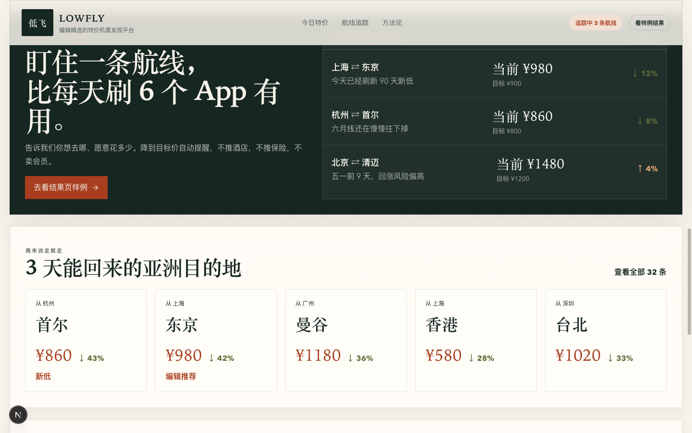

# flight-deal-finder-showcase

AI-coded editorial flight-deal prototype for curated discovery, true-cost breakdowns, and route tracking.

> Public showcase only. This repository presents a deterministic product prototype, not a live travel booking service.

Built for hiring review: a frontend-first AI product prototype showing product judgment, interface hierarchy, and transparent decision support under tight prototype scope.


This repository highlights:
- An editorial homepage that packages discounted-flight discovery as a weekly issue with curated picks, themed rails, and a route-tracker panel
- A results experience that separates face price from real trip cost and lets users switch between "Cheapest" and "Best Overall"
- A detail layer that makes fare rules, audience fit, and 90-day price history visible before a user decides whether to book or keep tracking

**Demo:** [Live site](https://meituan-flight-demo.vercel.app) · [Architecture notes](docs/architecture.md) · [Product brief](docs/product-brief.md) · [Demo script](docs/demo-script.md) · [Public release manifest](docs/public-release-manifest.md)

## Overview

`flight-deal-finder-showcase` is a frontend-first product prototype for editorial flight-deal discovery. The current product shell is framed as `LOWFLY`: a curated issue-style experience that surfaces a handful of worth-buying fares, shows route-tracker states, and explains why a fare is actually good instead of only showing a low headline number.

The key product question is still the same: cheap flights are easy to advertise but hard to interpret. What changed in this heavier revision is the presentation layer. Instead of a generic search-first homepage, the prototype now uses editorial curation, tracking language, and true-cost breakdowns to make the decision process feel closer to a credible consumer product.

This repository packages that idea as a public showcase. It is intentionally narrower than a real OTA, airline, or fare-alert business. The emphasis is on product framing, interface clarity, deterministic demo behavior, and a polished review flow rather than real inventory, payments, live crawling, or supplier integrations.

## Why This Project Matters

Flight shopping often breaks down at two moments: discovery and trust. Users can find low fares almost anywhere, but they still have to decide which ones are actually worth buying and whether the numbers on screen hide baggage fees, rigid changes, bad timings, or misleading "deal" framing.

This prototype turns that gap into a product surface:
- editorial curation before infinite search
- true trip cost before face price
- transparent rules before booking intent
- route tracking and price history as trust-building context, not as a fake backend claim

## Product Surface / Interface

| Editorial homepage | Route tracker and themed rails |
| --- | --- |
|  |  |

| Results verdict summary | Rule transparency and true-cost breakdown |
| --- | --- |
|  |  |

- The homepage is now editorial rather than purely transactional: issue framing, editor picks, route tracking, and themed destination rails create a stronger product identity.
- The results page is built around the gap between face price and real trip cost, then lets the user choose whether they want the absolute cheapest option or the most sensible overall one.
- The detail layer keeps users in context while surfacing cost breakdowns, rule transparency, audience fit, and synthetic 90-day price history.

## Decision Flow / How The Experience Works

1. Start from the editorial homepage: scan editor picks, route-tracker states, weekend rails, or holiday rails.
2. Open a featured route and land on a results page that immediately frames the route through a verdict summary and a face-price versus real-cost gap.
3. Switch between "Cheapest" and "Best Overall" depending on whether the user wants the lowest headline fare or the lowest-regret option.
4. Narrow choices with practical filters such as baggage, direct flights, flexibility, red-eye avoidance, and budget cap.
5. Open the detail drawer for a candidate fare and inspect cost breakdowns, fare rules, audience fit, and recent price history.
6. Leave with a clear next action: buy now, skip the fare, or keep tracking the route.

## What This Repository Demonstrates

- Editorial product framing for flight discovery rather than a generic booking UI
- Information architecture across a curation-led homepage, a verdict-driven results page, and an in-context detail drawer
- Deterministic local demo data powering featured deals, route-tracker states, cost breakdowns, and price-history charts
- Transparent communication of face price versus real cost, fare rules, and audience fit
- AI-assisted product copy used as a decision aid, not as a claim of live pricing intelligence or a real crawler pipeline
- A polished public-showcase package suitable for design, frontend, product, and AI-coding review

## What I Owned

- Interpreting the product brief and evolving it into a more opinionated MVP centered on editorial curation, route tracking, true-cost explanation, and decision support
- Defining the information architecture across the editorial homepage, verdict-driven results surface, and detail drawer so each screen has a clear job
- Designing how editor picks, route-tracker states, "Cheapest" versus "Best Overall", and rule transparency work together as one coherent decision flow
- Using AI-assisted development to iterate quickly on copy, component structure, and presentation while keeping the final prototype deterministic and reviewable
- Packaging the repository itself for public evaluation: documentation, screenshots, release framing, and repo hygiene for a hiring-facing showcase

## Public Scope

Included in this repo:
- The runnable Next.js prototype
- Deterministic local demo data and scoring logic for repeatable review
- Public-facing documentation, screenshots, and quickstart instructions
- Product and architecture notes that explain the prototype boundaries

Intentionally not included:
- Real airline or OTA inventory integrations
- User accounts, booking, payment, notifications, or order management
- Private environment files, secrets, deployment leftovers, or local caches
- Internal drafting notes and evaluation-specific working documents

Important scope note:
- The editorial issue number, route-tracker counts, weekly deal counts, carrier coverage, and price-history views are deterministic demo content inside the product shell. They illustrate the interface concept and decision model; they are not claims of a live ingestion or monitoring pipeline.

## Quickstart

Requirements:
- Node 22.x recommended
- npm 10+

Run locally:

```bash
npm install
npm run dev
```

Verify the project:

```bash
npm run lint
npm run build
```

Useful notes:
- The app uses deterministic local demo data. No API keys or backend services are required.
- A current public deployment is available from the live demo link above.

## Repository Guide

```text
app/                      App routes and global layout
components/redesign/      Current editorial homepage and results experience
components/home/          Legacy homepage modules retained in the repo history
components/results/       Legacy results modules retained in the repo history
lib/data/                 Deterministic datasets for the redesign and legacy flows
lib/utils/                Query parsing and supporting helpers
docs/                     Architecture, product brief, demo script, and release manifest
assets/readme/            README screenshots and repo hero assets
```

## Limitations / Non-goals

- This is a product prototype, not a production booking system.
- Fare data, route-tracker states, issue counts, and 90-day price history are deterministic demo content, not live inventory or live monitoring.
- AI-style recommendation text is presentation logic built on local rules and templates, not a live personalized model.
- There is no checkout flow, payment, login, loyalty system, or real price-tracking backend.
- The repository is optimized for reviewability and demo stability rather than operational complexity.

## Start Here

- [docs/product-brief.md](docs/product-brief.md)
- [docs/architecture.md](docs/architecture.md)
- [docs/demo-script.md](docs/demo-script.md)
- [components/redesign/home-page.tsx](components/redesign/home-page.tsx)
- [components/redesign/results-page.tsx](components/redesign/results-page.tsx)
- [lib/data/redesign.ts](lib/data/redesign.ts)

## License

This repository is released under the MIT License. See [LICENSE](LICENSE).

## Release Notes

See [Releases](../../releases) for the public showcase release history.
