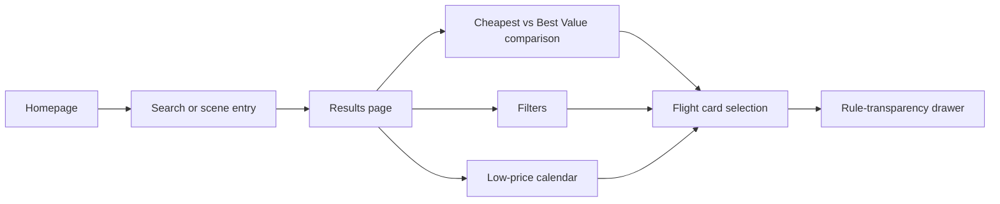
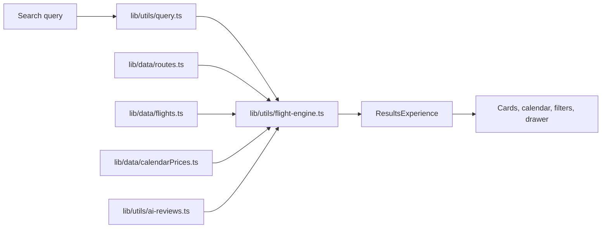

# Architecture

This repository packages a frontend-first flight-discovery prototype. The architecture is intentionally simple: deterministic local data, inspectable decision logic, and a polished UI flow that can be reviewed without private services or live supplier integrations.

## Product Goal

The product goal is not to complete booking. It is to help a user answer three questions quickly:
- Is this fare actually cheap?
- What hidden rules or costs come with it?
- Should I buy now, pay more for a better option, or shift the date?

## Experience Structure

## Page Responsibilities

### Homepage

Responsibility:
- establish the product framing
- offer both direct search and discovery-oriented entry points
- surface opportunity signals before the user commits to a route

Primary modules:
- hero search panel
- featured opportunity strip
- scene-based shortcuts
- trust and pricing explanation layer

### Results Page

Responsibility:
- turn a search or scene selection into a decision workspace
- separate "cheap" from "worth buying"
- keep comparison readable without hiding important tradeoffs

Primary modules:
- route summary and sort switch
- three-path conclusion cards
- low-price calendar
- filters for time, stops, baggage, flexibility, and risk suppression
- recommendation cards and full result list
- sticky decision summary

### Detail Layer

Responsibility:
- expose the hidden parts of the fare without leaving comparison context
- make tradeoffs legible before the user decides

Primary modules:
- one-line verdict
- benefits and tradeoffs
- audience fit
- full rule breakdown for baggage, refund/change, price composition, and transfer conditions

## Key Decision Modules

### Cheapest

The "Cheapest" path privileges total price and uses small tie-breakers such as stops, baggage, and timing. It answers: what is the lowest-cost option on this date?

### Best Value

The "Best Value" path adds weight for direct routing, baggage allowance, flexibility, daytime convenience, and lower transfer risk. It answers: what is the most balanced fare once obvious hidden costs are considered?

### Change Date

The low-price calendar answers: should the user shift the departure date instead of accepting the current list at face value?

### Rule Transparency

The drawer answers: what does this fare actually include, what does it restrict, and who is it a bad fit for?

## Data Flow

- Route availability is defined in local route records.
- Fare options come from deterministic flight templates.
- Calendar shifts change the price baseline for the selected route and date.
- Scoring logic derives both the cheapest ordering and the best-value ordering from the same underlying data.
- AI-style summaries are generated from local presentation rules and seeds, not from a live model call.

## Non-goals

- No real OTA backend
- No live pricing or inventory refresh
- No booking, payment, login, or order management
- No backend persistence for favorites or notifications
- No claim of real operational pricing intelligence beyond the deterministic demo rules in this repo
