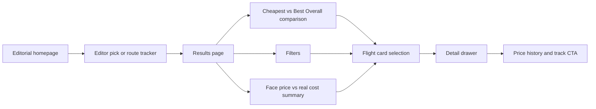
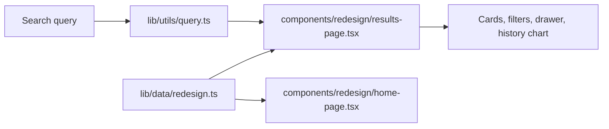

# Architecture

This repository packages a frontend-first flight-discovery prototype. The current architecture is built around an editorial product shell: curated deals, route-tracker states, true-cost breakdowns, and an inspectable results flow backed by deterministic local data.

## Product Goal

The product goal is not to complete booking. It is to help a user answer four questions quickly:
- Which fares are worth paying attention to right now?
- Is this fare actually cheap or only presented as cheap?
- What hidden rules or add-on costs come with it?
- Should I buy now, skip it, or keep tracking the route?

## Experience Structure

## Page Responsibilities

### Homepage

Responsibility:
- establish the product framing
- present discovery as an editorial product rather than a blank query form
- surface a small set of worth-buying fares before the user commits to a route
- make route tracking and themed exploration feel like first-class product modes

Primary modules:
- issue-style hero and discovery form
- editor picks grid
- route tracker panel
- themed destination rails
- method cards explaining how the product judges a fare

### Results Page

Responsibility:
- turn a selected route into a decision workspace
- separate "ticket face price" from "real trip cost"
- distinguish the cheapest option from the best overall option
- keep comparison readable without hiding important tradeoffs

Primary modules:
- route summary card
- cheapest versus best-overall switch
- filters for baggage, directness, flexibility, red-eye avoidance, and budget cap
- verdict-labeled result cards
- cost-gap summary strip
- in-context detail drawer

### Detail Layer

Responsibility:
- expose the hidden parts of the fare without leaving comparison context
- make tradeoffs legible before the user decides

Primary modules:
- AI verdict summary
- face price versus real cost breakdown
- fare-rule transparency
- audience fit
- 90-day price history
- track-route call to action

## Key Decision Modules

### Editorial Curation

The homepage does not try to model a complete search marketplace. Instead, it uses a constrained editorial layer to answer: which routes are worth paying attention to first?

### Cheapest

The "Cheapest" view privileges ticket face price. It answers: what is the absolute lowest headline fare, even if the hidden costs make it unattractive?

### Best Overall

The "Best Overall" view adds weight for baggage allowance, flexibility, direct routing, timing, and lower friction. It answers: what is the most sensible option once the true trip cost is taken seriously?

### True-Cost Breakdown

The cost breakdown answers: how much extra money or inconvenience sits behind the face price once bags, meals, change fees, and schedule penalties are surfaced?

### Route Tracking And History

The tracker and price-history views answer: should the user act now, or keep watching this route?

## Data Flow

- The homepage and results page both pull from deterministic datasets in `lib/data/redesign.ts`.
- Featured deals, route-tracker states, themed rails, and results packs are all locally defined.
- "Real cost" is composed from fixed breakdown items rather than a live calculation service.
- Price history charts are synthetic presentation data, not historical market records.
- AI-style verdict text is locally authored product copy and rules, not a live model call.

## Non-goals

- No real OTA backend
- No live pricing, crawling, or inventory refresh
- No booking, payment, login, or order management
- No backend persistence for tracking, alerts, or notifications
- No claim of real operational price intelligence beyond the deterministic demo rules in this repo
